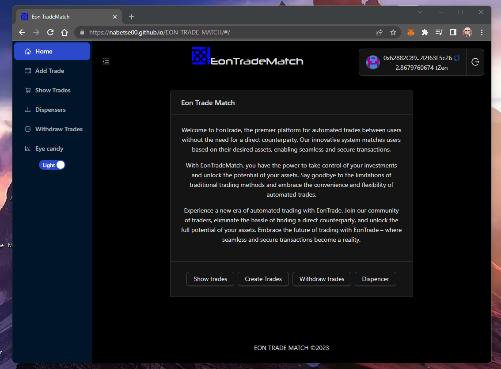
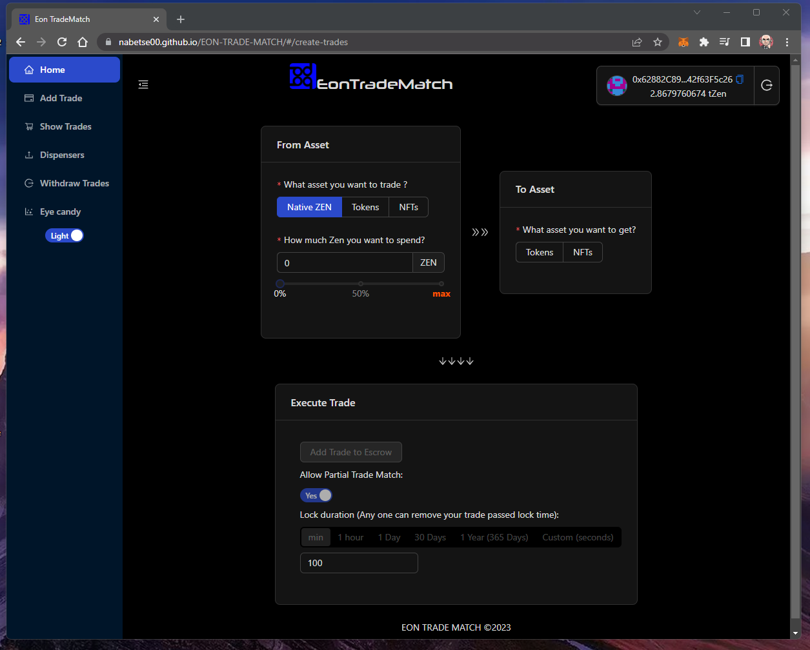
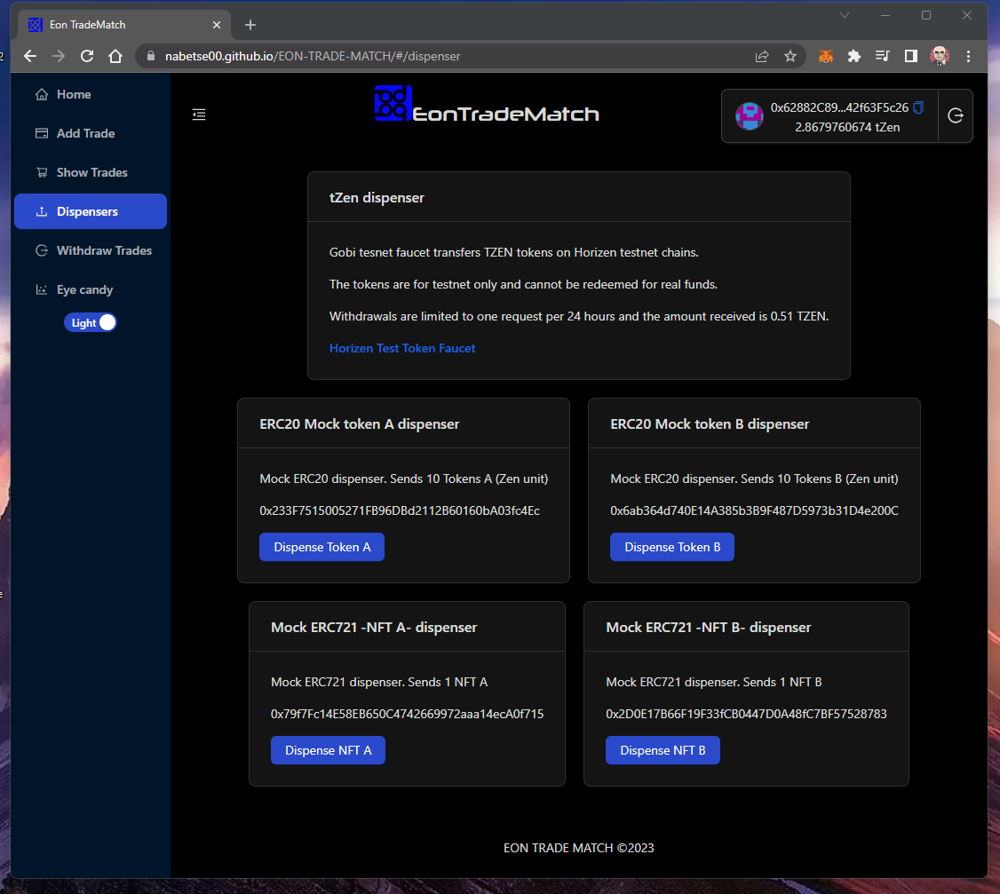

# Eon Trade Match


Welcome to Eon TradeMatch, the premier platform for automated trades between users without the need for a direct counterparty. Our innovative system matches users based on their desired assets, enabling seamless and secure transactions.

With EonTradeMatch, you have the power to take control of your investments and unlock the potential of your assets. Say goodbye to the limitations of traditional trading methods and embrace the convenience and flexibility of automated trades.

Experience a new era of automated trading with EonTrade. Join our community of traders, eliminate the hassle of finding a direct counterparty, and unlock the full potential of your assets. Embrace the future of trading with EonTrade – where seamless and secure transactions become a reality.

# Design

The trade system is designed with a single contract [Escrow.sol](./contracts/Escrow.sol).

This contract generates trades from user input.
It can be any of those types:

- Native Zen 
- ERC20 Tokens
- ERC721 NFTs

in any combination.

Contract matches trades and composes them. 
Meaning:
- if one user inputs a trade from ZEN to token A, another user form token A to token B
- contract creates a virtual trade from Zen to token B.

This process is recursive.

Please check source code for details.

# Instalation

In root and frontend directories run:
```console
npm install 
```

# Tests 

## Tests with localhost network with
Configure hardhat mining to auto, comment this line in [hardhat.config.ts](./hardhat.config.ts):
```ts
// line 38:
      // mining: {
      //   auto: false,
      //   interval: [3000, 6000]
      // },
```
then
```console
npx hardhat test
```

## Tests coverage:
```console
npx hardhat coverage
```

File              |  % Stmts | % Branch |  % Funcs |  % Lines |Uncovered Lines |
------------------|----------|----------|----------|----------|----------------|
 contracts\       |    98.54 |    81.03 |      100 |    96.82 |                |
  Escrow.sol      |    98.54 |    81.03 |      100 |    96.82 |... 554,618,619 |
 contracts\mocks\ |    78.57 |       50 |    66.67 |    78.57 |                |
  Erc20Mock.sol   |      100 |      100 |      100 |      100 |                |
  Erc721Mock.sol  |       75 |       50 |    57.14 |       75 |       46,50,56 |
All files         |    97.26 |    80.68 |     92.5 |    95.96 |                |

# Deployment

## local

In root folder copy [.env-example](.env-example) and rename it to .env
fill up needed data
```ts
ADDRESS="address"
MNEMONIC="your mnemonic here"
ALCHEMY_API_KEY="your alchemy api key here"
COINMARKETCAP_API_KEY="your coinmarketcap api key here"
# gas report 
REPORT_GAS = 'yes'
# NFT meta data server when using localhost should be 'https://localhost:port'
NFT_SERVER_URL="http://someurl.com"
```

Configure hardhat to mine blocks at intervals, uncoment:
```ts
// line 38:
      mining: {
         auto: false,
         interval: [3000, 6000]
       },
// ...
```

Run a hardhat localnet node 

```console
npx hardhat node
```

In another terminal deploy:
```console
npx hardhat run .\scripts\deployLocalTests.ts  --network localhost
```

This script will deploy some sample Tokens/nfts. Please fill 
[.env.development](frontend/.env.development) file in frontend directory
with your deployed addresses if diferent from provided
```
VITE_ESCROW_ADDRESS=...
VITE_ERC20_MOCK_ADDRESS_A=...
VITE_ERC20_MOCK_ADDRESS_B=...
VITE_ERC721_MOCK_ADDRESS_1=...
VITE_ERC721_MOCK_ADDRESS_2=...
```
Run the frontend and test:
```console
cd ./frontend
npm install
npm run dev 
```

For usage details please watch attached video demo.

## Eon Horizen Gobi testnet

Contracts are deployed and verified on gobi testnet
```ts
VITE_ESCROW_ADDRESS=0x96E7Cc0a9f026B2Fbf9a2B2e0e57C66F1aebADD7
VITE_ERC20_MOCK_ADDRESS_A=0x233F7515005271FB96DBd2112B60160bA03fc4Ec
VITE_ERC20_MOCK_ADDRESS_B=0x6ab364d740E14A385b3B9F487D5973b31D4e200C
VITE_ERC721_MOCK_ADDRESS_1=0x79f7Fc14E58EB650C4742669972aaa14ecA0f715
VITE_ERC721_MOCK_ADDRESS_2=0x2D0E17B66F19F33fCB0447D0A48fC7BF57528783 
```

A demo web site is in github pages at:
[https://nabetse00.github.io/EON-TRADE-MATCH/#/](https://nabetse00.github.io/EON-TRADE-MATCH/#/)

You can also run production preview form your computer with:

```console
\frontend> npm run build
\frontend> npm run preview
```

Don't forget to add a .env file in frontend directory with deployed contracts on gobi tesnet:
```env
VITE_ESCROW_ADDRESS=0x96E7Cc0a9f026B2Fbf9a2B2e0e57C66F1aebADD7
VITE_ERC20_MOCK_ADDRESS_A=0x233F7515005271FB96DBd2112B60160bA03fc4Ec
VITE_ERC20_MOCK_ADDRESS_B=0x6ab364d740E14A385b3B9F487D5973b31D4e200C
VITE_ERC721_MOCK_ADDRESS_1=0x79f7Fc14E58EB650C4742669972aaa14ecA0f715
VITE_ERC721_MOCK_ADDRESS_2=0x2D0E17B66F19F33fCB0447D0A48fC7BF57528783 
```
And broswse to http://localhost:4173/EON-TRADE-MATCH/ or similar.


## DEMO

- demo web site
https://nabetse00.github.io/EON-TRADE-MATCH/#/




- video 
[YT URL HERE]


